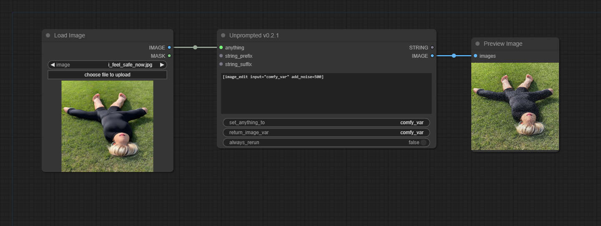

# Unprompted Node for ComfyUI

https://github.com/ThereforeGames/ComfyUI-Unprompted/assets/95403634/613c3c0f-5066-41c5-8aea-042afd1c7d47

This is a ComfyUI node that processes your input text with the Unprompted templating language. Early alpha release.

Please refer to the [main Unprompted repository](https://github.com/ThereforeGames/unprompted) for more information. Detailed documentation is available there. Thank you!

### Installation

Download the repository (or `git clone`) and move the files to your `comfyui/custom_nodes/ComfyUI-Unprompted` folder. Restart ComfyUI and you should now have access to the Unprompted node.

> ⚠️ **Note:** Some shortcodes were specifically designed for use with the Automatic1111 WebUI and are not compatible with this ComfyUI node. This node is primarily intended for text-based operations such as wildcards.

## Frequently Asked Questions

<details><summary>Where are my Unprompted templates located?</summary>

Your Unprompted templates are located in the `ComfyUI/venv/Lib/site-packages/unprompted/templates` folder. You can `[call]` files from this location using the node, e.g. `[call common/examples/human/main]`.

</details>

<details><summary>What are `string_prefix` and `string_affix`?</summary>

The prefix is added to the beginning of the main `string_field` box, and the affix is added to the end. These are simply for convenience.

</details>

<details><summary>How do I edit images with the Unprompted node?</summary>

As of v0.2.0, you can use the `anything` input to pass an image to the Unprompted node. To test this, please try the following workflow:



Note the use of the `anything` input and the `set_anything_to` widget. We set the image to the `comfy_var` variable, which is then accessed via the `[image_edit]` shortcode:

```
[image_edit input="comfy_var" add_noise=500]
```

We also ensure that the `return_image_var` widget refers to `comfy_var` so that we can see our changes to the image in the Preview Image node.